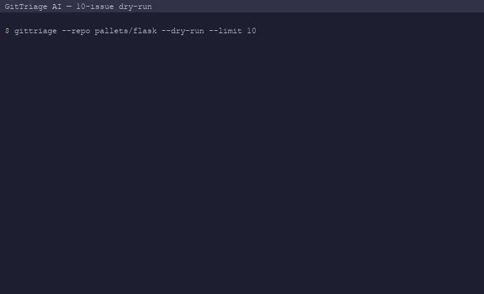

# GitTriage AI

> CLI agent that reads open GitHub issues and uses an LLM to auto-label, prioritize, cluster duplicates, and draft first replies.



## What it is

GitTriage AI is a local command-line tool that connects to any public (or private, with a token) GitHub repository, pulls its open issues, and runs them through a five-stage pipeline: classification into a fixed label taxonomy, priority scoring from 1–5, semantic deduplication using a local embedding model, draft reply generation for `bug` and `question` issues, and a final triage report rendered in the terminal and written to disk as `triage_report.md`.

Everything runs on your machine. No issue content is sent anywhere except to the LLM backend you configure — Claude by default, OpenAI via an environment variable switch. A bundled 30-issue fixture lets you run the full pipeline without a GitHub token at all.

## Quickstart

```bash
git clone https://github.com/RitikPatill/gittriage-ai.git
cd gittriage-ai

# Install dependencies (sentence-transformers pulls torch: ~500 MB on first run)
pip install -r requirements.txt
pip install -e .

# Set your API key
export ANTHROPIC_API_KEY=sk-ant-...

# Run against the bundled fixture — no GitHub token needed
gittriage --repo pallets/flask --dry-run --limit 10
```

## Usage

The `gittriage` command accepts a `--repo owner/repo` flag and runs the full pipeline, printing a Rich table and writing `triage_report.md`.

```bash
# Live run against a public repo
gittriage --repo owner/repo --limit 50

# Authenticated run (private repos or higher rate limits)
gittriage --repo owner/repo --token ghp_xxx --limit 100

# Save report to a custom path
gittriage --repo owner/repo --output reports/flask.md

# Tighten the dedup threshold (default 0.88)
gittriage --repo owner/repo --threshold 0.92

# Switch to OpenAI backend
LLM_PROVIDER=openai OPENAI_API_KEY=sk-... gittriage --repo owner/repo --dry-run
```

The terminal output is a color-coded table — priority ≥ 4 rows in red, priority 3 in yellow — with columns `#`, `Title`, `Label`, `Priority`, and `Dup of`. The written report includes a summary (total issues, label counts, duplicate count) and per-issue details with draft replies.

| Variable | Default | Description |
|---|---|---|
| `ANTHROPIC_API_KEY` | *(required)* | Claude API key |
| `ANTHROPIC_MODEL` | `claude-haiku-4-5-20251001` | Override Claude model |
| `LLM_PROVIDER` | `anthropic` | Set to `openai` to use OpenAI |
| `OPENAI_API_KEY` | — | Required when `LLM_PROVIDER=openai` |
| `OPENAI_MODEL` | `gpt-4o-mini` | Override OpenAI model |
| `GITHUB_TOKEN` | — | PAT for private repos / higher rate limits |

## Architecture

```
GitHub REST API
      │
      ▼
fetcher.py  ──► [list of issue dicts]
      │
      ├──► triage.py (Anthropic / OpenAI)
      │         label, priority, draft_reply
      │
      └──► dedup.py (sentence-transformers)
                 duplicate_of
                 │
                 ▼
            cli.py
         ┌────────────┐
         │ Rich table │  terminal
         └────────────┘
         ┌──────────────────┐
         │ triage_report.md │  disk
         └──────────────────┘
```

## Project structure

```
src/gittriage/
├── cli.py            # Typer entry point; orchestrates the pipeline
├── fetcher.py        # PyGithub issue fetching and dry-run fixture loader
├── triage.py         # LLM classification, priority scoring, draft replies
└── dedup.py          # sentence-transformers cosine similarity deduplication

tests/
├── test_fetcher.py   # fetcher unit tests (dry-run + mocked live)
├── test_triage.py    # triage unit tests (mocked LLM API)
├── test_dedup.py     # dedup unit tests
├── test_cli.py       # CLI integration tests (no real API calls)
└── fixtures/
    └── sample_issues.json   # 30-issue dry-run fixture
```

## Roadmap

- [ ] `--apply` flag to post draft replies and apply labels via the GitHub API
- [ ] Incremental mode: skip issues already present in a previous report
- [ ] Configurable label taxonomy via a YAML file
- [ ] HTML report output in addition to Markdown
- [ ] GitHub Actions workflow to run triage on a cron schedule

## License

MIT — see [LICENSE](LICENSE).

---

Built autonomously by [autodev](https://github.com/RitikPatill/autodev),
a multi-agent orchestrator I designed. Each commit in this repo was
authored by me; the implementation work was performed by Sonnet under
the orchestrator's control. Read the orchestrator's README to see how.
